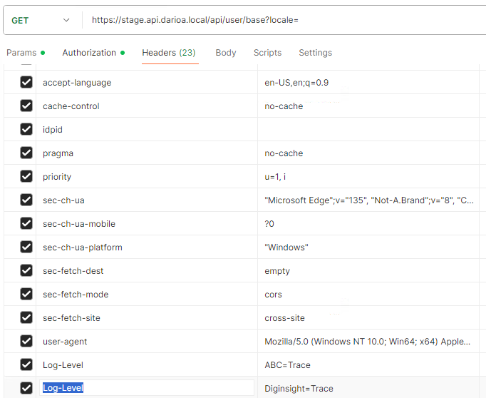
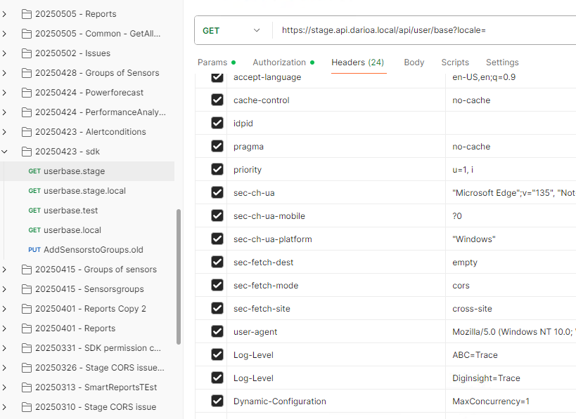

Diginsight Components configures <mark>application observability</mark> with **Log4Net**, **Console Logging** and **OpenTelemetry** tracing by default.
This setup provides a solid foundation debugging your applications.

Diginsight also supports <mark>Dynamic Logging</mark>.
This allows you to change the logging level at runtime without restarting the application.

the combination of the two features enables:

- **best performance**: log is normally disabled or set to `Warning` or `Error` level, only when needed, you can enable `Debug` or `Trace` level, only for specific calls.
- **detailed insights**: when an issue occurs, you can enable detailed logging for the specific operation, capturing all relevant information without overwhelming the log with unnecessary details.
- **detailed insights on the remote environments**: with OpenTelemetry, full traces about you requests can be collected to the remote observability tools (e.g. Azure Application Insights, Jaeger, etc.).
this allows insight of the application behavior across multiple components and multiple application hops.

## Table of Contents

- [🔧 Use Dynamic Logging for environment troubleshooting](#-use-dynamic-logging-for-environment-troubleshooting)
- [🌐 Application flow on the remote environments](#-application-flow-on-the-remote-environments)
- [⚡ Analyze performance issues on the remote environments](#-analyze-performance-issues-on-the-remote-environments)
- [🔀 Debugging Parallel Operations](#-debugging-parallel-operations)
  - [The Challenge with Parallel Logging](#the-challenge-with-parallel-logging)
  - [Dynamic Concurrency Control with ParallelService](#dynamic-concurrency-control-with-parallelservice)

## 🔧 Use Dynamic Logging for environment troubleshooting

Logging on every runtime environment is normally configured to `Warning` or `Error` level, to avoid performance issues and log flooding.

```json
  "Logging": {
    "LogLevel": {
      "Default": "Warning",
      "Microsoft": "Warning",
      "ABC": "Warning",
      "Microsoft.Hosting.Lifetime": "Warning",
      "System.Net.Http.HttpClient": "Warning",
      "*.IdentityLoggerAdapter": "None",
      "Diginsight.SmartCache.Externalization.ServiceBus": "Warning"
    }
  },
```

Verbose log levels are not needed event for test environments, because you can enable it dynamically when needed.

When reproducing a call with detailed logging, you can enable `Debug` or `Trace` level by means of the <mark>`Log-Level`</mark> HTTP header:



in such case the call will be fully traced and the log will contain all the application flow about the enabled categories:

<!--  -->
<!-- TODO: Add screenshot showing detailed trace log output -->

In such case the environment **console log** will contain the **same details we would obtain on the local developer machine**.

## 🌐 Application flow on the remote environments

With OpenTelemetry enabled, every request is traced and the trace is sent to the configured observability tool (e.g. Azure Application Insights).

<!--  -->
<!-- TODO: Add screenshot showing OpenTelemetry trace in Application Insights -->

## ⚡ Analyze performance issues on the remote environments

The remote environmants are precious to analyze performance issues.
Most often, bad performance is due to number of calls, or data volumes trasnferred, from databases or external services to the application.

Still without performance issues it may be interesting to analyze the cost of calls to external services or databases.

Diginsight query_cost metric allows identifying the cost of database calls for every single query.

This allows identifying the most expensive queries, and optimize them.

<!--  -->
<!-- TODO: Add screenshot showing query cost metrics -->

## 🔀 Debugging Parallel Operations

When applications use **parallel processing** to improve performance, debugging becomes significantly more challenging. Multiple threads executing simultaneously create **interleaved log entries** that are difficult to follow and analyze.

### The Challenge with Parallel Logging

Consider this scenario with parallel operations:

```
[Thread 1] Processing item A - Started
[Thread 3] Processing item C - Started  
[Thread 2] Processing item B - Started
[Thread 1] Processing item A - Database query
[Thread 3] Processing item C - Validation failed
[Thread 2] Processing item B - External API call
[Thread 1] Processing item A - Completed
[Thread 2] Processing item B - Timeout error
```

This **jumbled log output** makes it extremely difficult to:

- Follow the execution flow for a specific item
- Understand the sequence of operations
- Identify which errors belong to which processing thread
- Debug complex business logic interactions

### Dynamic Concurrency Control with ParallelService

**Diginsight ParallelService** addresses this challenge by providing **dynamic concurrency control** that can be adjusted at runtime without restarting the application.

During debugging, you can:

1. **Disable parallelism completely** by setting concurrency to 1
2. **Reduce concurrency levels** to make logs more manageable  
3. **Adjust settings via environment variables** or configuration

```json
{
  "ParallelServiceOptions": {
    "MaxConcurrency": 1,        // Disable parallelism for debugging
    "LowConcurrency": 1,        // Single-threaded I/O operations  
    "MediumConcurrency": 1,     // Single-threaded mixed workloads
    "HighConcurrency": 1        // Single-threaded CPU operations
  }
}
```

With ParallelService, you can easily switch between **sequential execution for debugging** and **full parallelism for production** by means of the `MaxConcurrency` HTTP header.:




This approach allows you to maintain **optimal performance in production** while ensuring **clear, readable logs during debugging sessions**.


